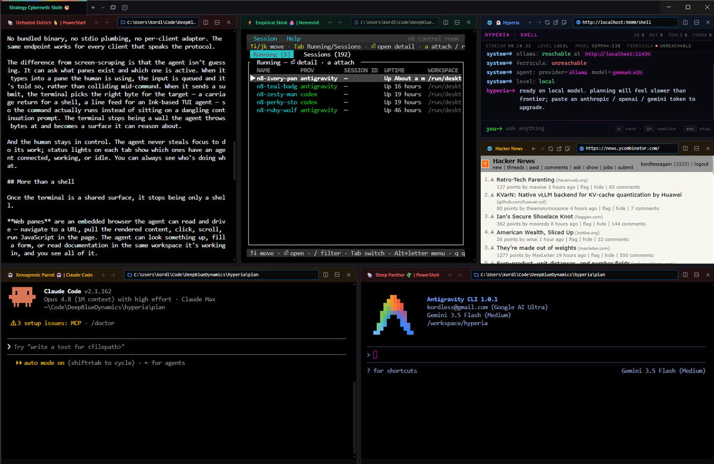

# Hyperia™

**A terminal emulator built for agents and humans.**



Hyperia is an agent-native terminal emulator. Forked from [Hyper](https://github.com/vercel/hyper) and extended with a Rust sidecar, it turns the terminal into a first-class platform for AI orchestration. Agents connect over the Model Context Protocol (MCP) and operate terminal sessions as peers — opening tabs, splitting panes, running commands, reading screens, and reporting status — while the human stays in control at all times.

Built by [Deep Blue Dynamics](https://deepbluedynamics.com).

---

## Highlights

- **Agent-native MCP server** — 63 tools exposed over streamable HTTP. Any MCP-capable client (Claude Code, OpenAI Codex, Google Antigravity, and others) can drive the terminal: open tabs, split panes, run commands, read screens, manage sticky notes, and inspect telemetry.
- **Ghost agent** — A built-in assistant with streaming chat, tool use, and persistent memory. It is aware of what is open, what is running, and what it has done before.
- **Local memory & search** — A built-in BM25 index over your shell history and sticky notes, so an agent can search what you actually ran and wrote — not just the visible screen. An optional external memory service (Ferricula) can be attached for cross-session recall.
- **Agent status lights** — An agent can flag its tab as connected, working, or idle (via the `agent_status` tool), so you can see at a glance which tabs it's driving. It's a signal the agent raises, not auto-detection.
- **Pane Pulse (agent watchdog)** — Attach a recurring prompt to a pane that the **sidecar** re-submits on its own, independent of any agent's loop — so a stalled agent (or even a stalled *supervising* agent) keeps moving. It's idle-gated by default (re-pokes only when the pane looks stuck), capped to a one-hour lifetime, and never steals focus (`pane_pulse_set`). Agents can also arm a safe one-shot self-poke for the next time they go idle (`pane_on_idle`) and self-report busy/idle (`pane_busy` / `pane_idle`) — even from inside a container — so the watchdog tells real work from a quiet screen.
- **Human-in-control by design** — Agents never hijack your view. Cross-pane focus and pulses surface **passively** — the owning tab flashes a 🔔 — and need an explicit `force` to pull your screen; only your input (and the Stream Deck) moves it. Driving a pane an agent doesn't own raises a **centered consent prompt**, reachable from any tab; approving auto-runs the command it was holding. When one agent pokes another, the message is stamped with a `From:` header so the recipient knows who called.
- **Stickys™** — Floating, named, color-coded notes that persist across restarts and are fully controllable from any agent.
- **Shell profiles** — PowerShell, CMD, WSL, Git Bash, or any custom shell, surfaced in the new-pane chooser.
- **Sidecar architecture** — A dedicated Rust process (`hyperia-sidecar`) provides the HTTP, WebSocket, and MCP surfaces, decoupled from Electron for speed and reliability.
- **`hyperia` CLI** — A bundled MCP client for scripts and lightweight agents: curated verbs (`status`, `run`, `split`, `focus`, `open`, `cd`, …), a `doctor` health check, and a `guide`. Build standalone with `yarn build:cli`.
- **Shell integration** — Panes report their live working directory and running app, with safe `cd` from the new-pane picker and from agents.
- **Stream Deck Plus support** — An optional companion daemon ([`tools/deck-mcp`](tools/deck-mcp)) turns an Elgato Stream Deck Plus into a physical control surface: focus/split/new-tab your panes from the touch strip and dials, switch apps from the keys.
- **Telemetry dashboard** — Per-pane metrics at `http://localhost:9800/dashboard`.

---

## Quick start

```bash
git clone https://github.com/DeepBlueDynamics/hyperia.git
cd hyperia
yarn install

cd sidecar && cargo build && cd ..

yarn start
```

See [docs/getting-started.md](docs/getting-started.md) for prerequisites and full build instructions. Prebuilt, signed installers for Windows and macOS are available on the [Releases](https://github.com/DeepBlueDynamics/hyperia/releases) page.

---

## Connect an agent (MCP over HTTP)

While Hyperia is running, the sidecar exposes its MCP server over **streamable HTTP**:

```
http://localhost:9800/mcp
```

No API key or local binary path is required — point any MCP client at that URL. (The port is `9800` by default; override it with `HYPERIA_PORT`.) The examples below assume Hyperia is running on the same machine as the client.

### Claude Code

Register the server with the CLI:

```bash
claude mcp add --transport http hyperia http://localhost:9800/mcp
```

Add `--scope user` to make it available across all projects. To configure it per-project instead, commit a `.mcp.json` at the repository root:

```json
{
  "mcpServers": {
    "hyperia": {
      "type": "http",
      "url": "http://localhost:9800/mcp"
    }
  }
}
```

Verify with `claude mcp list` or `/mcp` inside a session.

### OpenAI Codex

Add the server to `~/.codex/config.toml`:

```toml
[mcp_servers.hyperia]
url = "http://localhost:9800/mcp"
```

Codex discovers the tools on its next launch. Confirm with `codex mcp list`.

### Google Antigravity

Open the MCP settings (**Settings → MCP → Add Server**), or edit Antigravity's MCP configuration file directly:

```json
{
  "mcpServers": {
    "hyperia": {
      "serverUrl": "http://localhost:9800/mcp"
    }
  }
}
```

Reload the MCP servers from the settings panel; Hyperia's tools then appear in the agent's tool list.

### Other clients

Any client that supports the MCP streamable-HTTP transport works the same way — register the URL `http://localhost:9800/mcp`. The full tool catalog is documented in [docs/mcp-tools.md](docs/mcp-tools.md).

---

## macOS: file-access prompts

On macOS you may see system prompts like **"‹App› would like to access files in your Documents folder"** (also Desktop, Downloads, or removable/network volumes) the first time you start an agent — whether you launch it inside Hyperia, run the Ghost agent, or start nemesis8 (n8) from a native terminal.

This is macOS's **TCC** (Transparency, Consent & Control) privacy system — not Hyperia or n8. macOS protects those folders for *every* app, including terminal emulators and the command‑line tools they spawn, and prompts once (per app, per folder) the first time a process reads or writes there. Granting it lets the agent work with files in that location; denying just keeps that folder off‑limits.

- **The prompt names the "responsible" app, not the agent.** Launch an agent inside Hyperia and the prompt says *Hyperia*; start n8 from Terminal.app or iTerm and it names *that terminal*. Approve it for the app you actually trust.
- **n8 containers are scoped to the workspace you launched in** — the container only sees that directory tree, not your whole disk. The prompt is about the *host's* access to the underlying folder (needed to read/share it into the container), so macOS can still ask even though the container itself is sandboxed. Allow or deny per your needs; widening access to other folders is opt‑in.
- **You can change your mind anytime** in **System Settings → Privacy & Security → Files and Folders** (and **Full Disk Access** for broader access) — toggle an app off there to revoke access you previously granted.

This behavior is macOS‑only; Windows and Linux don't gate folder access this way.

---

## Documentation

| Document | Description |
|----------|-------------|
| [Getting Started](docs/getting-started.md) | Install, build, and first launch |
| [MCP Tools](docs/mcp-tools.md) | Complete tool reference |
| [Ghost Agent](docs/ghost-agent.md) | Built-in assistant — models, memory, behavior |
| [Configuration](docs/configuration.md) | Config file reference and keyboard shortcuts |
| [Memory & Search](docs/memory.md) | Local search (lume) + optional external recall (Ferricula) |
| [Architecture](docs/architecture.md) | Codebase structure and component overview |
| [Building](docs/building.md) | Release builds — Windows (Azure Trusted Signing) and macOS |
| [Apple Signing](docs/signing-apple.md) | macOS code signing and notarization |

---

## Architecture

```
Electron (UI + PTY sessions)
    │
    │── WebSocket bridge ──▶ hyperia-sidecar (Rust, :9800)
                                  │
                                  ├── HTTP API (terminal, agent, notes, telemetry)
                                  ├── MCP server (streamable HTTP at /mcp, 63 tools)
                                  ├── Ghost agent (streaming, tool loop)
                                  ├── lume — local BM25 over shell logs + notes
                                  │     └── ~/.hyperia/lume/
                                  ├── Ferricula client (optional external memory service)
                                  └── Telemetry + dashboard
```

---

## License

BSD 2-Clause — see [LICENSE](LICENSE).

Based on [Hyper](https://github.com/vercel/hyper) by Vercel.
