# Hyperia Architecture

```mermaid
graph TB
    subgraph Electron["Electron Process (Main)"]
        direction TB
        INDEX["index.ts\napp lifecycle · tray · sidecar spawn"]
        BRIDGE["bridge.ts\nWebSocket client · session registry\nBSP coords · PTY stream"]
        WINDOW["ui/window.ts\nterminal window creation\nnode-pty spawn"]
        STICKY["sticky.ts\nfloating note windows"]
        SETTINGS["settings.ts\ntoken · model · shivvr URL"]
        GHOST_UI["ghost.ts\nagent chat window\nSSE stream consumer"]
    end

    subgraph Renderer["Renderer Process (lib/)"]
        direction TB
        REACT["lib/index.tsx\nReact + Redux UI\nBSP layout calc\npane labels a/b/c…"]
        XTERM["xterm.js\nterminal rendering\nWebGL / canvas"]
        REDUX["Redux store\nterm-groups (BSP tree)\nsessions · tabs · UI"]
    end

    subgraph Sidecar["Rust Sidecar · hyperia-sidecar (port 9800)"]
        direction TB
        AXUM["main.rs\nAxum HTTP server\nREST API /api/*"]
        WS_HANDLER["bridge.rs\nWebSocket handler\nsession state · BSP coords\ntype-and-collect · output subs"]
        
        subgraph Ghost["Ghost Agent"]
            REGISTRY["registry.rs\ntool definitions + handlers\nterminal_* · sticky_note_*\nfile_* · web_fetch"]
            CHAT["chat.rs\nClaude API streaming\ntool loop · context"]
        end

        MCP["mcp.rs\nMCP server (stdio)\nsame tools as Ghost"]
        FERRICULA["Ferricula\nembedded memory\nBM25 + vector search\nnotes.json · durable store"]
    end

    subgraph External["External Services"]
        CLAUDE_API["Anthropic Claude API\nstreaming · tool use"]
        SHIVVR["Shivvr\nshivvr.nuts.services\nvector embeddings"]
        MCP_CLIENT["MCP Clients\nClaude Code · etc."]
    end

    %% Electron internal
    INDEX -->|spawns| Sidecar
    INDEX -->|starts| BRIDGE
    INDEX -->|creates| WINDOW
    WINDOW -->|registerSession| BRIDGE
    BRIDGE -->|commands: Split/Focus/Close/Keys/NewWindow| WINDOW
    BRIDGE -->|NoteCreate/Update/Delete| STICKY
    REACT -->|session layout sync + BSP| BRIDGE

    %% Renderer internal
    REACT <-->|IPC| REDUX
    REACT --> XTERM

    %% Bridge ↔ Sidecar WebSocket
    BRIDGE <-->|"WebSocket /ws\nSessionData · SessionLayout\nHeartbeat · Commands"| WS_HANDLER

    %% PTY data flow
    WINDOW -->|"PTY bytes (base64)"| BRIDGE
    BRIDGE -->|"SessionData stream"| WS_HANDLER

    %% Sidecar internal
    AXUM --> WS_HANDLER
    AXUM --> Ghost
    AXUM --> FERRICULA
    REGISTRY -->|HTTP calls to /api/*| AXUM
    CHAT -->|tool results| REGISTRY

    %% Ghost agent HTTP tools → bridge commands
    REGISTRY -->|"terminal_* tools\n→ /api/pane/*, /api/type*"| AXUM
    REGISTRY -->|"sticky_note_* tools\n→ /api/notes/*"| AXUM

    %% MCP
    MCP_CLIENT <-->|stdio| MCP
    MCP -->|same bridge commands| WS_HANDLER

    %% External
    CHAT -->|streaming API| CLAUDE_API
    GHOST_UI -->|"SSE /api/ghost/stream"| AXUM
    GHOST_UI -->|"POST /api/ghost/chat"| AXUM
    FERRICULA <-->|embed requests| SHIVVR
    SETTINGS -->|token · model · shivvr| AXUM
```



## Data Flows

### PTY Output (terminal → sidecar)
```
node-pty → bridge.ts hook → WebSocket send SessionData{uid, data: base64}
  → bridge.rs SessionData handler → decode → vt100 screen update
  → output_subs broadcast (for type-and-collect)
```

### Agent Command (sidecar → terminal)
```
Ghost tool call (e.g. terminal_split{label:"b"})
  → registry.rs POST /api/pane/focus{pane:"b"}
  → bridge.rs → WebSocket send Focus command
  → bridge.ts handleCommand → window.emit('termgroup:focus')
  → POST /api/pane/split → bridge.ts → window.emit('termgroup:split')
```

### BSP Layout Sync (renderer → sidecar)
```
Redux state change (split/resize)
  → lib/index.tsx calcBspLayout() → {uid, x, y, width, height}
  → IPC 'session layout sync' → bridge.ts updateSessionLayout()
  → tracked.bspX/Y/W/H updated
  → WebSocket send SessionLayout{uid, bsp:{x,y,width,height}}
  → bridge.rs SessionLayout handler → info.bsp_x/y/w/h updated
  → GET /api/pane/where?a=b&b=c → spatial relation response
```

### Memory Query (agent → ferricula)
```
Ghost recalls context → POST /api/memory/search{query}
  → ferricula BM25 keyword search + Shivvr vector similarity
  → ranked results → injected into agent context
```

## Key Design Decisions

- **Sidecar as agent peer** — the Rust sidecar is not just a helper; it IS the agent. It drives the terminal through the bridge exactly as a human would.
- **BSP tree in Redux** — Hyper's `termGroups` reducer is a binary space partition tree. `calcBspLayout()` traverses it to compute percentage bounding boxes for each pane, enabling spatial reasoning.
- **type-and-collect** — instead of polling the screen after keystrokes, the sidecar subscribes to raw PTY output before sending keys and collects bytes until 400ms of silence, returning actual shell output.
- **Split labels are ephemeral** — pane labels (a, b, c…) are assigned by BSP left-to-right traversal order and re-sort when the tree changes. UIDs are the stable identity; labels are for orientation.
- **MCP and Ghost share tools** — `registry.rs` defines tool schemas once; both the Ghost agent loop and the MCP server dispatch through the same handler.
```
